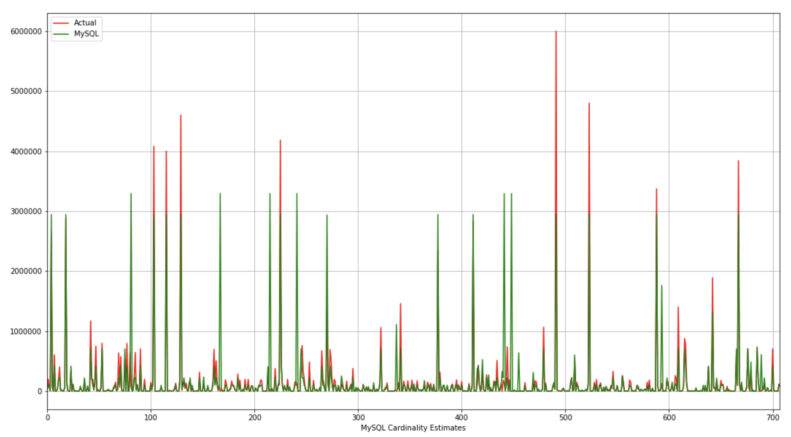
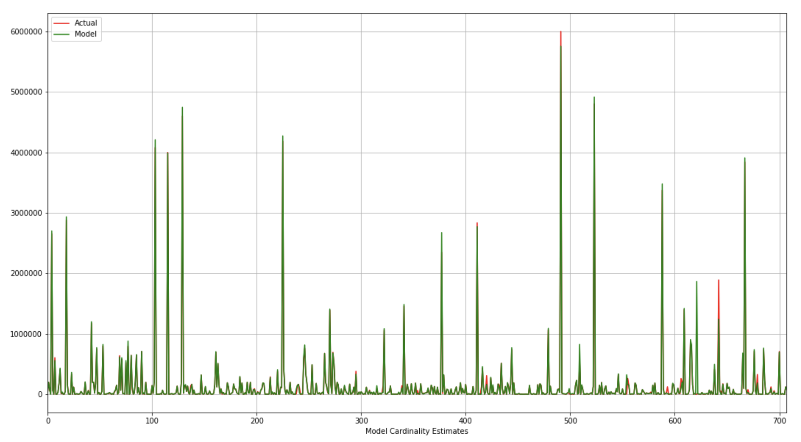

# Cardinality Estimate with Deep Learning

## Introduction
---

In a database query optimzer, cardinality estimation has become critical to determine an optimal query plan. Most of commercial and  open source databases collect statistics using histograms with hueristics to estimate cardinality. However, this approach usually has the following problems:

* Histograms and hueristics approach tends to require data to be unformaly distributed. This is usually not the case in real customer databases.
* These statistics usually do not capture the relationships among dependent columns without explicit instructions from users.
* The estimation errors are always amplied as queries get more complex.

This project report shows that *supervised* deep learning techniques can be applied to solve this problem and achieve a better cardinality estimate than MySQL.

## Prepare Data
---

### Source Database
[TPC-H](http://www.tpc.org/tpch/) is an industry standard dataset for database benchmark. To introduce skewness, a [skewed version](https://www.microsoft.com/en-us/download/details.aspx?id=52430) of TPC-H is used to generate the dataset. For this report, a 1GB dataset is generated with random skewness to various columns across the dataset.

### Query Encoding and Labeling
To have a simple but meaningful experiment, the input query is limited to *SELECTION-JOIN* style queries (*PROJECTION* doesn't affect the cardinality) **without** aggregations, and only conjuctions are used in the selection. Also, only one foreigh key constraint is allowed between any of two relations. Thus, each query has the following format:
```
SELECT * FROM t1 JOIN t2 ON ... JOIN t3 ON ... WHERE ... AND ... AND ...;
```

#### Query Encoding
Queries need to be encoded to be fed into the network, and the encoded input should be able to uniquely identify each query. Since all queries are limited to *SELECTION-JOIN* style, two concatenated vectors are used to encode each query:
```
vec1 := a positional bitmap of all relations appearing in joins.
vec2 := a positional vector of numeric selection conditions.
```
Thus, <code>vec1</code> has a length of 8 since TPC-H dataset contains 8 relations, and <code>vec2</code> has a length of 11 since the entire dataset has 11 numeric columns. Note that the model can be generalized to any type of columns. The selections are normalized as <code>(val - min) / (max - min)</code> (the min and max of all numeric columns are hand-collected). The following is an example of the original query and encoded input:
```
SELECT *
FROM orders
JOIN customer ON o_custkey = c_custkey
JOIN nation ON c_nationkey = n_nationkey
WHERE o_custkey >= 5923.41
  AND c_acctbal >= 5239.41;

| 1,0,1,1,0,0,0,0, | 0.5875,0,0,0,0,0.0395,0,0,0,0,0 |
```

#### Labeling
Since this is *supervised* training and MySQL is used for comparison, for each encoded input, both *estimated cardinality* from MySQL and the *actual* cardinality are collected (only the *actual* cardinality is used as label). The following SQL command is run per query and obtain these two values from a MySQL 8.0 database with skewness version of TPC-H dataset:
```
mysql> EXPLAIN ANALYZE <sql_query>\G
```
As an example, MySQL produces an estimate of <code>19043</code> rows for the following query, while the actual number of rows is <code>17020</code> (This is a happy case).
```
mysql> EXPLAIN ANALYZE SELECT * FROM lineitem JOIN partsupp ON l_partkey = ps_partkey WHERE l_extendedprice >= 78558.55\G
*************************** 1. row ***************************
EXPLAIN: -> Nested loop inner join  (cost=11243.96 rows=19043) (actual time=7.912..1110.370 rows=17020 loops=1)
    -> Index range scan on lineitem using l_extendedprice, with index condition: (lineitem.l_extendedprice >= 78558.55)  (cost=5067.43 rows=4255) (actual time=7.762..330.017 rows=4255 loops=1)
    -> Index lookup on partsupp using PRIMARY (ps_partkey=lineitem.l_partkey)  (cost=1.00 rows=4) (actual time=0.102..0.138 rows=4 loops=4255)

1 row in set (1.30 sec)
```

#### Result Dataset

As a result of previous steps, a result dataset of the following format is produced:
```
| vec1 | vec2 | MySQL Estimated | Actual |

| 1,0,1,1,0,0,0,0, | 0.5875,0,0,0,0,0.0395,0,0,0,0,0 | MySQL Estimated | Actual |
```
It's very expensive to analyze queries in MySQL when it has large number of rows. Due to the resource limitation, the whole dataset contains 3500+ entries.

## Model Setup
---
* Dataset is split with ```60/20/20``` for training/validation/testing.
* The deep learning model is set up to have ```3``` hidden layers with ```256``` nodes on each layer. In total, it has ```136,961``` trainable parameters. ```Adam``` optimizer is used with ```ReLU``` activation. ```Mean squared logarithmic error``` is used as the loss function.
* The model is trained for ```1000``` episodes.

### Model Summary
```
Model: "sequential_6"
_________________________________________________________________
Layer (type)                 Output Shape              Param #   
=================================================================
dense_23 (Dense)             (None, 256)               5120      
_________________________________________________________________
dense_24 (Dense)             (None, 256)               65792     
_________________________________________________________________
dense_25 (Dense)             (None, 256)               65792     
_________________________________________________________________
dense_26 (Dense)             (None, 1)                 257       
=================================================================
Total params: 136,961
Trainable params: 136,961
Non-trainable params: 0
```

## Results
---

A comparison between *MySQL* estimates and *Model* estimates is shown below. ```Loss``` is the ```mean squared log error``` used for training, and ```Score``` is [explained variance score](https://scikit-learn.org/stable/modules/model_evaluation.html#explained-variance-score). ```Absolute``` is in terms of the number of rows.

| Syntax      | Loss         | Mean Absolute  | Max Absolute  | Score        |
| ----------- | -----------  | -----------    | -----------   | -----------  |
| MySQL       | 1.158        | 84589.64       | 3293921       | 0.52149      |
| Model       | 0.534        | 12939.16       | 1757615       | 0.97745      |

The model testing result can be visualized with the following two graphs:






## Future Improvements
---

### Better Normalization

In this report, the ```SELECTION``` is normalized as <code>(val - min) / (max - min)</code>, which assumes data is uniformaly distributed. This can be improved by utilizing the histrograms from MySQL statistics package for more accurate representation. That is - this model can be bootstrapped with the vanilla statistics package in any databases. This should yield a better result or make the model converges faster.

### More Training Data

It would be interesting to see how model performs with even training samples. It took over 24 hours for MySQL to analyze 3500+ queries with 500 threads on an 8-core laptop. 

### Feedback Loop

When this model is built into the query optimizer, another reinforcement learning model can be attached to it. After a query is executed, the model can compare the model estimtes with the actual number of rows, and applies a credit policy model to achieve better model performance. This essentially creates a positive feedback loop.


## References
---

* [An Empirical Analysis of Deep Learning for Cardinality Estimation](https://arxiv.org/pdf/1905.06425.pdf)
* [Neo: A Learned Query Optimizer](http://www.vldb.org/pvldb/vol12/p1705-marcus.pdf)
